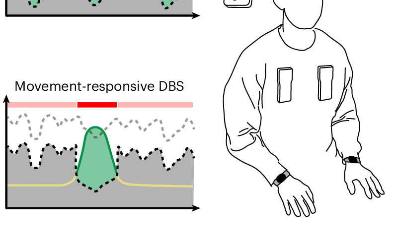

# Alicia Zeng — personal site

Static hand-written HTML, one stylesheet and one small script. No build
step, no framework.

    index.html                      homepage
    research.html                   publication list
    notes.html                      working notes, newest first
    research/superpositions.html    the NeurIPS paper as a short tutorial (facts from thesis chapter 2)
    research/stimulation.html       the home-recording DBS study, explained (thesis chapter 3, verbatim)
    research/number.html            the time–space–number result, told from the theory of magnitude (CCN 2026 poster page)
    research/dbs.html               the Nature BME aDBS paper, a short introduction (facts and two figures from the CC BY preprint)
    research/thesis.html            the thesis
    figures/                        real figures from the work: the NeurIPS poster, Fig. 1 of the Nature BME paper and Figs. 2 and 6 of its medRxiv preprint, thesis Figures 2.1–2.7, 2.9 and 3.1–3.6, and the 16:10 card crops (`*-thumb.*`; `number-thumb.jpg` is the number word cloud from thesis Fig. 2.6, shown whole via `.thumb--contain`)
    files/                          the thesis PDF (33 MB)
    styles.css                      everything visual, including the abstract artwork
    site.js                         the homepage attractor and the paper-page section nav; optional
    styles-dark.css                 the previous design, kept for a one-line revert

## Running it

Open `index.html` in a browser and it works. To serve it over `http://` —
worth doing to check it on a phone:

    cd ~/projects/website && python3 -m http.server 8000

Then `http://localhost:8000`, or `http://<your-mac's-LAN-IP>:8000` from a
phone on the same wifi.

## Deploying it

Any static host. Upload the whole directory, keeping `research/` as a
subdirectory — the paper pages link back out with `../`, so the structure has
to survive.

## Design notes

Black, after szymonkaliski.com: the system sans, one text size, bold for
headings, underlined links, gray for metadata, and a `↗` after every link
that leaves the site. The palette is seven tokens at the top of
`styles.css`; the page is committed to dark (`color-scheme: dark`) rather
than following the OS.

There are **no network requests** beyond the site's own files: no web font,
no analytics, no embeds. `site.js` is optional — with it off you lose the
homepage animation and the highlighted section name in the paper-page nav,
nothing else.

The previous design is kept verbatim in `styles-dark.css`. To go back, point
each page's `<link rel="stylesheet">` at it and re-add the Space Grotesk
`<link>` tags it expects.

### Animation versus real figures

The rule that decides where each kind of image goes:

- **Decorative, abstract animation** is allowed in exactly two places: the
  homepage hero (a Lorenz attractor drawn by `site.js`) and the thumbnail
  slot of a research card, as a stand-in until a real image exists. It is
  never captioned, never appears on a paper page, and is `aria-hidden`.
- **Anything from the work itself** — a figure, a poster, a video — goes in
  the same thumbnail slot on the cards and, with a caption, on the paper
  page. It always wins over the decoration: when a real image exists, the
  abstract one goes.

All three cards now show real crops (the NeurIPS poster, Fig. 1 of the
Nature BME paper, Figure 3.1 of the thesis); the abstract `.viz` stand-ins
are still in `styles.css` for a future card with no figure yet. The
homepage attractor stays either way: it is on the person's page, not a
paper's, and nothing about it claims to be data.

### The hero

`<canvas class="hero-viz">` at the top of `index.html`, filled by `site.js`
with a Lorenz attractor point cloud that turns slowly. It is drawn in the
text colour, uses no images, and under `prefers-reduced-motion` draws one
still frame. Delete the canvas element to remove it.

### The research cards

Each card is `<div class="thumb">` holding the image and the paper's
abstract, then the title. The abstract is the paper's own abstract,
verbatim, and appears over the image on hover or keyboard focus (never on
touch screens, where the whole card is simply the link). It is clipped after
about ten lines; the full text is on the paper page.

The image is either a real figure (`` or a muted looping `<video>`) or
an abstract, decorative `.viz` drawn in pure CSS (`.viz--pulse`,
`.viz--basis`, `.viz--atoms`). Swapping one for the other is one element:

```html
<!-- decorative stand-in -->
<div class="viz viz--pulse" aria-hidden="true"><span></span></div>

<!-- real still: crop it to 16:10 or let object-fit crop it -->


<!-- real looping video abstract -->
<video src="figures/dbs-thumb.mp4" autoplay loop muted playsinline></video>
```

The same block appears on `index.html` and `research.html`; change both.

### Paper pages

Each paper page is the Nerfies / Waller-lab shape: centred title, authors,
venue, a row of pill buttons, a sticky section list, one teaser figure,
then Abstract, Summary, one section per idea, BibTeX. `site.js` underlines
the section you are in.

To add a section: duplicate one `<section class="paper-section">`, give it a
new `id`, and add a matching `<li>` to the `paper-nav` list. A figure in a
section is a `figure.fig` with the media and a caption (no page currently
carries a dashed `.fig-slot` placeholder, but the class is still in the CSS
if you want one):

```html
<figure class="fig">
  
  <!-- or -->
  <video src="../figures/dbs-decoder.mp4" autoplay loop muted playsinline></video>
  <!-- or, for a hosted video that allows embedding -->
  <iframe src="https://www.youtube.com/embed/…" title="…" allowfullscreen></iframe>
  <figcaption>What the reader should see in it.</figcaption>
</figure>
```

Abstracts are duplicated on purpose — on the card (clipped, on hover) and on
the paper page (in full) — and both copies must stay verbatim.

### Explainer pages

`research/superpositions.html`, `research/number.html`,
`research/stimulation.html` and `research/dbs.html` are explainers in the
shape of John Hewitt's structural-probe page and the Waller lab's
EncodingInformation site: title, buttons, hero figure, one pulled sentence,
then the work told in sections with the figures interleaved. They differ in
who wrote the words and in how much they say.

**Superpositions is a short tutorial.** Its running text was written for the
page (plain language, no equations beyond a boxed "for the algebra-inclined"
note), so it is *not* thesis text and can be edited freely; what must not
drift are the facts. Every number on it — 300 → 1,000 atoms, the 0.03 % vs
2.18 % cosine overlap, ΔR² = 0.00047 ± 0.00071 with t(6) = −1.77, p = 0.13,
inter-subject map consistency 0.26 ± 0.04 vs 0.09 ± 0.04, the top-5,000-voxel
overlaps (IoU 0.32–0.34 pairwise, 0.18 three-way), the 0.70 ± 0.08
cross-subject similarity, |r| = 0.00 ± 0.10 vs 0.16 ± 0.14 — and every word
list in the eight-row atom table comes from chapter 2 of the thesis (Table 2.1
for the word lists). The Abstract section is the paper's abstract verbatim and
must match the research card. Stat tiles use `ul.stats`, the boxed note
`.box` + `.box-label`, the opening paragraph `p.tldr`.

**Number is a tutorial too.** `research/number.html` is the page for the CCN
2026 poster ("A Distributed Cortical Network Integrates Semantic
Representations of Number, Space, and Time", Hendrikx, Zeng, Yashaswini,
Visconti di Oleggio Castello, Gallant). It opens from Walsh's theory of
magnitude (2003), Dehaene (1997) and Dehaene & Brannon (2010), then tells the
time–space–number case study of thesis chapter 2 (Section 2.6.5): atoms 505 /
81 / 997, top-5,000-voxel composite maps, IoU 0.34 / 0.32 / 0.32 pairwise and
0.18 three-way, the within-domain atom-pair map similarities from the
supplement (0.50, 0.50, 0.43–0.46 vs 0.05 across domains), and the 798–81–505
branch of the Figure 2.7 dendrogram. Figures: 2.6 (hero), 2.1, 2.9 (the
dense-model control, newly exported to `figures/thesis-fig2-9.jpg`) and 2.7.
The poster's abstract is on the page verbatim from the CCN 2026 site
(`https://2026.ccneuro.org/poster/?id=V6IilrmWYe` — the conference's own
listing; OpenReview blocks fetching but the CCN page links its PDF), with a
source line giving the session (C46, Session C, Wednesday 5 August). Note the
abstract describes a 19-participant analysis and a tuning continuum, while the
page's figures and numbers are the seven-listener thesis case study — the
source line says so explicitly. No poster file or video is published anywhere
(CCN 2026 hosts neither, and there is no NeurIPS entry for it), so the "CCN
poster" button stays a stub; on her pointer to neurips.cc/virtual/2025/poster/120024
the page instead carries a Poster section with the NeurIPS 2025 poster of the
method paper (same `figures/superpositions-poster.png`, whose time/space/number
panel is this analysis) and a Video button to its SlidesLive talk. On the
research page it is now a card (Cognition group, above the birdsong `minor`
entry) with the CCN abstract behind the hover and the number word cloud as
its thumb; CCN and OpenReview links live on the page itself.

**DBS is a short introduction, not a tutorial.** You are the third of eleven
authors on the Nature BME paper, so `research/dbs.html` describes the study
rather than narrating it as "we", in the register of the thesis introduction
(measured, systems-minded, no jokes — she asked for exactly that; on
2026-09-04 the same register was applied, lightly, to the prose of the
superpositions and number pages, with every number and all verbatim blocks
unchanged): five short
sections (short version, closing the loop, optimized at home, the blinded
comparison, my part), the last one stating your
contribution from the paper's author-contribution statement (designed the
data-collection infrastructure with G.S., T.F. and R.B.; analysed the data
with T.C.D., G.S. and R.B.), linking the JoVE platform paper and thesis
chapter 3. The published article is not open access, so every number on the
page — 6 home sessions of ~25 min, 682 candidate models, personalized bands
+6 % / +3 %, held-out 83 % / 76 %, 12 blinded sessions over 154 days with the
last 435 days after training, 82 % / 76 % online, 1.6 / 1.9 / 2.2 mA,
r = 0.52 and −0.44, 0.33 keypresses/s — and the pull quote come from the
CC BY 4.0 medRxiv preprint (10.1101/2024.08.14.24312002), and its Figures 2
and 6 are on the page as `figures/dbs-preprint-fig2.jpg` and
`dbs-preprint-fig6.jpg`, credited in their captions. If the published
version's numbers differ, the preprint's stand until you change them. The
hero is still the publisher's Fig. 1; its long legend is kept verbatim inside
a folded `<details class="legend">` under a one-line caption of mine.

**Stimulation is verbatim.** Every sentence of its body text is thesis
chapter 3, from the PDF; the only words that are not hers are the short
`.source` line under the pull quote, the image `alt` texts and the BibTeX
`note`. Equations are hand-transcribed into MathML from the rendered PDF
pages (check the ridge objective and the pose `cos θ` formula against the
PDF). It was generated, not hand-written: the builders live outside the repo
in the session scratchpad (`build/lib.py`, `build_stim.py` alongside the
extracted `thesis/text.txt`), so edit the HTML directly; if you ever need to
regenerate, the recipe is: extract the PDF text with the PDFKit script,
choose paragraph line ranges, and let the library strip page headers, rejoin
hyphenated line breaks and fix the PDF's spacing artifacts. Hyphenation at
line breaks was decided word by word ("counterbalanced",
"electrophysiological" joined; "multi-output", "leave-one-day-out",
"keystroke-based" kept).

**Superpositions** has its real material: the hero is thesis Figure 2.1,
the poster sits in its own section
(`figures/superpositions-poster.png`, 2592 × 1296, from neurips.cc, served
through `<picture>` as `superpositions-poster.webp` — cwebp q88, 0.6 MB
instead of 1.5 — with the PNG as fallback and "Full size" link), and the
buttons link to OpenReview, the NeurIPS page, the poster, the SlidesLive
video, the code (the GitHub URL from the thesis footnote) and the thesis.
SlidesLive refuses to be embedded anywhere but neurips.cc ("Domain not
allowed"), so the video is a link, not a frame. The card thumbnail is a crop
of the same poster (`figures/superpositions-thumb.png`). Figures 2.1–2.7 are
in `figures/thesis-fig2-*`.

**Stimulation** (chapter 3, "Deep Brain Stimulation Amplifies
Movement-Related Neural Modulation in Parkinson's Disease") carries Figures
3.1–3.6 (`figures/thesis-fig3-*.jpg`, exported at 1600 px from the PDF at
3× and cropped to the plot). Its buttons go to the thesis PDF, the thesis
page and the Nature BME paper page; the card thumbnail is panel (a) of
Figure 3.6 (`figures/stimulation-thumb.jpg`). Section 3.4.4's packet-merging
detail and the supplementary patient instructions are left to the PDF.

**DBS** has Fig. 1 of the paper as its teaser (`figures/dbs-fig1.png`, from
the publisher's figure page, legend verbatim but folded) and a crop of it as
the card thumbnail. The article itself is not open access; the figure is here
on the strength of your being an author — your call whether that is fine. The
two body figures are from the CC BY preprint and need no permission.

**Thesis** is built entirely from the PDF (`files/Thesis-Alicia_Zeng.pdf`):
the abstract, the introduction (chapter 1, split into Introduction /
Chapter 2 / Chapter 3 / Summary and Motivation), the acknowledgments and
the dedication, all verbatim, with Figures 3.1 (teaser), 2.1 and 3.6 and
their captions. The card thumbnail is the spectrogram block of Figure 3.1.
Each chapter section ends with a link to its explainer page, and the
buttons include "Chapter 2 as a paper" and "Chapter 3 in full".

Motion respects `prefers-reduced-motion`. There is no scroll-driven reveal.

## Links that are already real

Verified against Crossref, PubMed and the NeurIPS site — not typed from
memory:

| work | link |
|---|---|
| Disentangling superpositions | OpenReview `3aNvX9TQTo`, NeurIPS 2025 poster page, poster PNG, SlidesLive `39050668` |
| Movement-responsive DBS | `10.1038/s41551-025-01438-0`, PubMed 40579487 |
| Bringing the Clinic Home | `10.3791/65305` (J. Vis. Exp., 2023) |
| In-Home Video and IMU Kinematics | `10.36227/techrxiv.22067474` (preprint, 2023) |
| A Distributed Cortical Network Integrates … Number, Space, and Time | OpenReview `V6IilrmWYe` (CCN 2026 poster) |
| A Nonlinear Dynamical System Approach to Bird Song Analysis | ADS `2019APS..MARL70298Z`, plus the *Song Attractor* video on YouTube |

The OpenReview and ADS entries were checked by you, not by a script — those
two sites block automated access.

### Titles and author lists

Titles are the published ones. Every entry carries its full author list in
published order (`<p class="authors">`), with you marked
`<span class="me">…</span>`. You publish under two names: **Alicia Zeng**
everywhere, and **Xiao Zeng** on the 2019 APS abstract — the markup uses
whichever the venue printed.

On the homepage the three cards show only "Title — venue, year"; the author
lists are on `research.html` and on each paper page.

### Research groups

`research.html` is three groups in your order — **Bayesian inference**
(superpositions, thesis), **Real-world data** (movement-responsive DBS,
Bringing the Clinic Home, In-Home Video and IMU Kinematics) and
**Cognition** (number/space/time, birdsong). Each group is a
`<section class="block group">` holding a `pub-grid` of cards and/or a
`minor-list`; move an entry by moving its block. The homepage keeps its
three cards ungrouped.

### The arc

The "2017 to now" section on the homepage is one sentence per beat — the
first sentence of each beat from your draft, nothing added. The rest of the
draft's beat prose is not on the page; the draft is the place to recover it.

## Placeholders to fill in

Bracketed text is a marked placeholder, not copy. Find every one:

    grep -rn 'class="todo"' *.html research/

Replace it and delete `class="todo"` and `data-todo`. Link placeholders are
`<a>` elements with **no `href`** — per spec that makes them a placeholder for
a link rather than a link, so they are not focusable and do not appear in a
screen reader's links list as working resources. Adding the real `href` is
what turns one into a live link.

**index.html** — `2020-2025-stimulus` (inside the one 2020–2025 sentence),
`invitation-line`, `link-google-scholar`, `link-github`, `link-orcid`

**research.html** — `research-list-incomplete`

**notes.html** — `notes-intro`, then `note-1-date` / `note-1-body` and
`note-2-date` / `note-2-body` for the two sample entries

**research/dbs.html** — `link-dbs-code` only (the Code button; drop the
button if there is no public repository).

**research/superpositions.html** and **research/stimulation.html** — none.

**research/number.html** — `link-number-poster` only (the poster file, if
she wants to host it; nothing is published online).

**research/thesis.html** — `link-thesis-doi` (the eScholarship record),
`link-thesis-code`

### Adding a publication

Copy an existing `<article class="pub pub--card">` block inside
`<div class="pub-grid">` in `research.html` (and `index.html`, if it belongs
there) and copy a paper page under `research/`, keeping the section ids and
the nav list in step. The venue sits inside the title element as
`<span class="pub-meta">`, and CSS puts the " — " between them. Each title is
written **once** per page; on a paper page the links are named by
`aria-labelledby="<link-id> <heading-id>"`, so a screen reader reads
"PDF, *title*" without the title being stored twice.

For a co-authored paper, preprint or talk that doesn't need its own page, add
an `<li class="minor">` to the `minor-list` of the right group instead and
link straight out.

### Adding a note

Copy an `<li class="note-item">` to the **top** of `<ol class="stream">` in
`notes.html` and set both the `datetime` attribute and the visible date.
