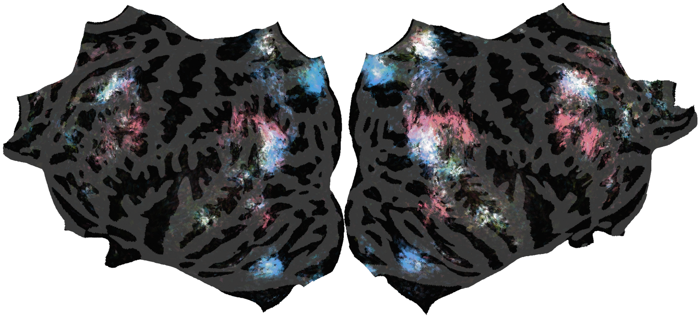
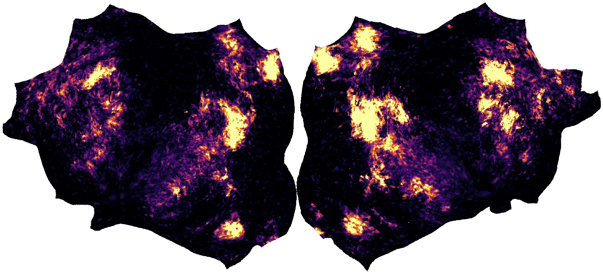

# viewer-compose-2026

Interactive brain viewer for:

> Zeng, A., Gallant, J.L. (2025).
> [Disentangling superpositions: interpretable brain encoding model with sparse
> concept atoms](https://neurips.cc/virtual/2025/poster/120024). *NeurIPS*.
>
> Hendrikx, E., Zeng, A., Yashaswini, Visconti di Oleggio Castello, M., Gallant, J.L. (2026).
> A cortical network processing quantity-related concepts. *CCN* (poster).

Dense word embeddings entangle semantic features in superposition; the Sparse Concept
Encoding Model transforms them into a higher-dimensional, sparse, non-negative space of
learned concept atoms — an axis-aligned semantic basis where each dimension corresponds
to an interpretable concept, enabling direct readout of conceptual selectivity from
voxel weights. The number, time, and space atoms were fit as their own model band,
disentangling the overlapping cortical representations of the three quantities.

Voxelwise encoding models were fit to fMRI responses of 19 participants listening to
naturalistic stories. Three interpretable semantic dimensions — **number**, **time**,
and **space** — were isolated from a sparse concept space (Zeng & Gallant, 2025) and fit
as a separate band in a banded ridge regression, alongside low-level features and the
remaining 997 semantic dimensions.

## Viewers

- `group/` — 19-subject average on the fsaverage surface (default)
- `S01/`, `S02/`, `S04/` — example individual subjects in their native anatomy

Each viewer offers two map families (Map chips in the top bar) and three channel
toggles (Number / Time / Space); every combination of channels is a baked dataset:

| Map | Description |
|---|---|
| Number-Time-Space tuning | Three additive channels. Channel strength = the share of the voxel's variance that dimension explains within the full model (its split R²; counted only where the dimension's weight is positive). The shares are additive (they sum to the quantity band's R²), and every tuning map is one fixed rendering of their sum: **opacity** = summed R² of the channels switched on (0 → the group map's 99th percentile of channel R², one absolute scale shared by all channels and all brains), **hue** = the channels' proportions (two channels → mixture hue; all three → white). The cortex is rendered dark (curvature brightness 0.18, contrast 0.2), so dark = little variance explained; only strong, jointly selective voxels reach white. |
| Quantity network | Prediction accuracy of the three quantity features alone — how much of each voxel's response they predict within the joint model, cross-validated leave-one-story-out across the 10 training stories (√(split R²) of the quantity band; inferno, vmax = per-brain 95th percentile) |
| Channel toggles | One channel = that dimension's own map; two = their overlap; three = the joint map. Toggling is exact because each subset is the same rendering function applied to a subset of the channels. |
| Tuning tetrahedron | The legend (bottom left, three.js): every vertex/voxel is a point at its channel vector (R²_number, R²_time, R²_space)/vmax, in its exact map color. Since opacity is the *sum* of the split R², iso-opacity surfaces are planes parallel to the color triangle (the face Σ = 1, top of the color scale); the apex (0,0,0) is nothing explained, and a voxel's direction from the apex is its tuning (R² shares = hue). Voxels beyond vmax are projected onto the face, like the map's opacity clip. Two channels → the colored edge + the triangle it spans; one → a ramp. Clicking the cortex marks that voxel. |

## Interactive features

- **Click-a-voxel inspector** — click the cortex to see that spot's number/time/space
  profile (R² shares), its position in the tuning tetrahedron, a reliability meter, and the example
  words it responds to (from small per-brain `inspect.bin` sidecars, ~1–5 MB, lazy-loaded).
- **Guided tour** — a six-step narrated fly-through of the findings (unfold animation,
  map switches) driven by the viewer's built-in `animate()`.
- **Example-word chips** — the highest-loading vocabulary per dimension, in the legend
  and as tooltips on the per-dimension map chips.
- A per-map colorbar (bottom left) with the actual numeric scale for the active brain.
- Idle auto-rotate until first interaction; 2400×1200 snapshot download; other brains
  prefetched in the background for fast switching; shareable
  `#brain/map` deep links; map and camera state preserved across brain switches.

## Provenance

Built with [pycortex](https://gallantlab.org/pycortex) (`cortex.webgl.make_static`).
Data-extraction and build scripts live in the `compose` analysis repository under
`scripts/20260830_web_viewers/`.

- Cross-validation folds with non-finite or |R²| > 1 values (degenerate voxels, <0.2%)
  are excluded before averaging.
- Tuning channels are per-dimension split R² (full-model product measure per
  20260317_nst_rgb.py Fig 3: ŷ_other includes the lowlevel and 997-dim semantic
  bands), sign-gated by the voxel's weight; R² units are directly comparable
  across subjects. Group maps average R² (not √R²) across subjects.
- Rendering (`nst_render` in `02_build_viewers.py`): each channel is a light vector
  L_d = (R²_d / vmax) · anchor_d with linear-RGB anchors number (1, .02, .10),
  time (.02, .55, .05), space (.20, .30, 1.00). Opacity = Σ_d R²_d / vmax (clipped at 1);
  hue = the max-normalized anchor mix of the channel proportions, sRGB-encoded.
  vmax = shared 99th percentile of the three channels per brain. The pycortex
  webgl shader composites premultiplied alpha; vertex colors (group) are
  premultiplied in the build, volume textures (subjects) are premultiplied by
  WebGL on upload, so both are stored to match. Colorbar numbers show
  2 significant digits.
- Group maps: each subject's maps are projected to fsaverage
  (`cortex.mapper.utils.vol2surf`, line-nearest mapper, thick mask), zeroed where that
  subject's **full-model** permutation p ≥ 0.05 (the fits carry no band-specific
  permutation test), then averaged; vertices significant in no subject are transparent.
- Single-subject viewers apply the same per-subject mask as the group pipeline
  (full-model permutation p < 0.05; ~20% of voxels pass), so they show exactly what
  enters the group average. Unmasked, the other ~80% of voxels carry ~55% of the
  summed quantity split R² and render as hue confetti (the `20260317_nst_rgb.py`
  recipe figures are unthresholded). The viewers sample the volume at 32 depths
  through the cortical sheet (`Surface._layers = 32`, the webgl equivalent of
  quickflat's `thick=32` used for the recipe's figures); a single depth sample
  renders voxel maps as speckle.
- Tuning-map scale: a single subject's 99th percentile of channel R² is ~3× the
  group's (S01 0.0081, S02 0.010, S04 0.011 vs group 0.0025) because of the heavy
  noise tail of unaveraged voxels, so a per-brain p99 stretched the subject maps onto
  a scale where little was visible. All brains therefore share the group's scale; the
  subjects' strongest voxels (~4%) clip at the top, like the group's top 1%.
- Time in the group map: within subjects the three dimensions explain comparable
  shares of the quantity band's variance (number 35 ± 5%, time 32 ± 5%, space
  33 ± 4%; mean ± SD, N = 19), and time is the largest in 4 of 19 subjects (S01, S08,
  S13, S18). Time's peaks are less anatomically consistent across subjects
  (mean inter-subject spatial correlation of the fsaverage maps: number 0.15, time
  0.10, space 0.22), so they average down more: the group p99 is 0.0015 for time vs
  0.0027 (number) and 0.0029 (space), i.e. 43% vs 52–57% of the mean single-subject
  p99. The group map understates time relative to the single-subject maps.
- The abstract reports R² on the held-out test story; the viewers show the
  cross-validated training-story estimate.

## Deployment

Static site — serve as-is. For GitHub Pages: push the `main` branch to a public repo,
then **Settings → Pages → Build and deployment → Source: Deploy from a branch →
Branch: `main`, folder `/ (root)`**. `.nojekyll` is included (required — the viewer
data files start with underscores, which Jekyll would exclude). The viewers require
http(s); they will not load from `file://`.
